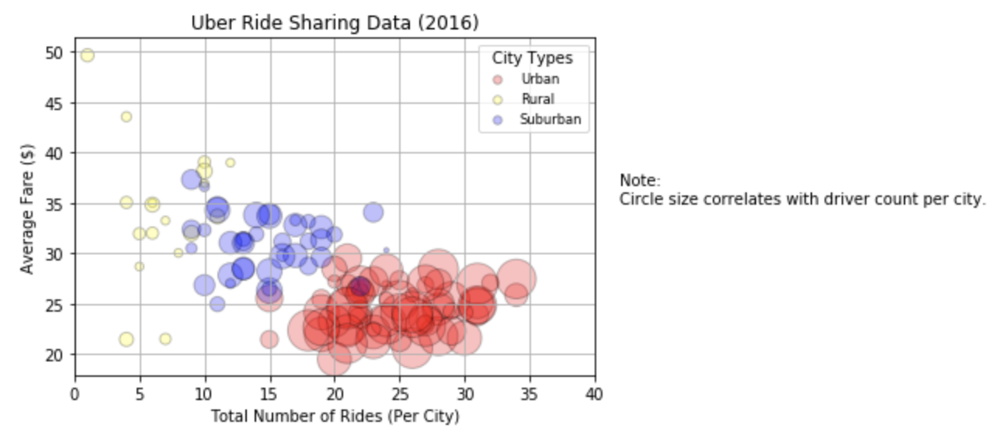
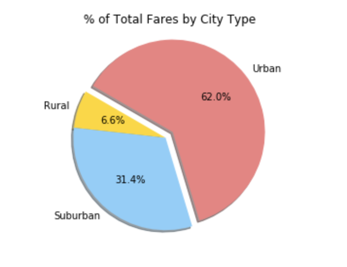
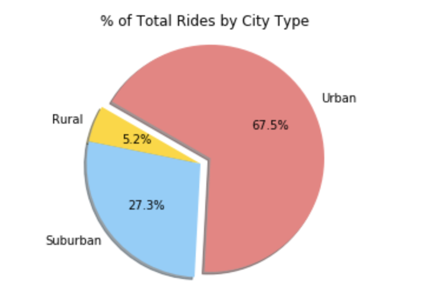
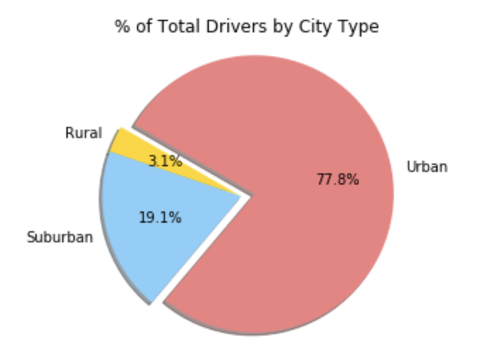

# Uber-Ride-Data-Analysis

## Purpose
The purpose of this project was to get familiar with Uber's rideshare data and leverage the skills of Matplotlib to perform visualization and analysis. 

## Objective 
This particular dataset included information such as city, city type, fare, driver count and etc. Thus objective was to find insights about distribution of drivers and variance in price in different parts of the city/conutry. 

## Approach 

    1. Data Cleaning
        - Check for empty columns 
        - Drop the empty columns 
        - Check for repeat values

    2. Perform Analysis 
        - Scatter Plot 
        - 3 Pie Charts

    3. Draw Conclusions 
        - Based on the analysis, summarize the conclusions. 

## Analysis & Metrics 

**Bubble Chart:** The point was to compare `Total Number of Rides per City`  against `Average Fare($)`. The bubbles were sized by the amount of drivers by the city. For a better categorization, the cities were grouped in to `Rural`,`Urban` and `Suburban`

**Pie Chart: % of Total Fares by City Type:** The point of this pie chart was to see the distribution of the `Sum of fares` by the city type. This indicates how expensive each ride was by `city type`.

**Pie Chart: % of Total Rides by City Type:** The point of this pie chart was to see the distribution of the `Total number of Rides` by the city type. This indicates where the app was most popular by `city type`.

**Pie Chart: % of Total Drivers by City Type:** The point of this pie chart was to see the distribution of the `Total number of Drivers` by the city type. This indicates popular is the app amonst drivers and the avaiblity of drivers by `city type`.

## Conclusions 
 * Roughly `70%` of all rides and total fare value come from `Urban riders`.
* `Rural riders` tend to take significantly `higher cost`, albeit fewer, trips than Urban or Suburban riders.
* While comprising of roughly `35%` of all rides and fares, `Suburban and Rural cities` afford only `22% of Uber's total driver population`. There may be a strategic opportunity here to boost driver counts in these regions to enhance market share.

## Advantages 
- Using this data, Uber's marketing team can set prices that are normalized in all differenty type of cities. 
- Moreover, the marketing team can then focus on increasing the amount of drivers in rural areas so the fare can get cheaper. 
- The marketing team can further deep dive in to this data to target specific riders. 